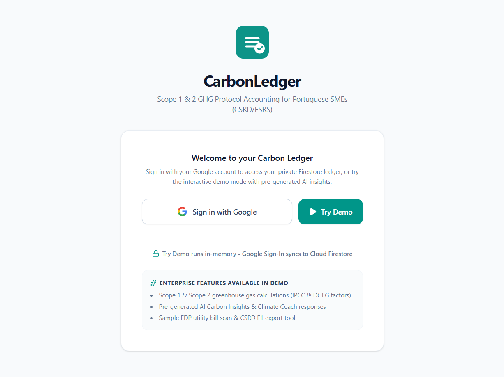
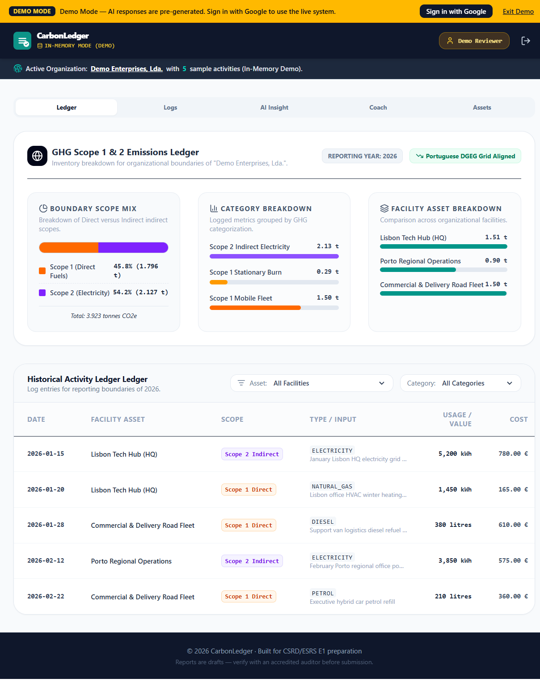
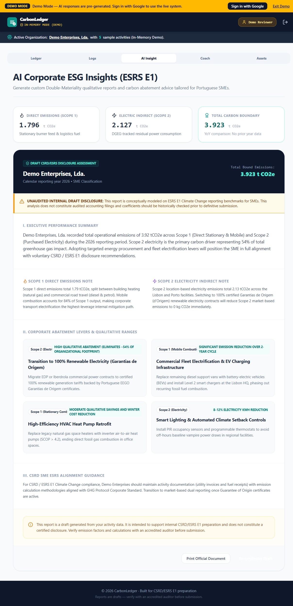

# CarbonLedger

A full-stack carbon accounting platform for Portuguese SMEs. Track 
Scope 1 & 2 emissions, scan utility bills, and generate 
CSRD/ESRS-aligned reports — with AI-powered decarbonization 
recommendations.

**Live:** [carbon-intelligence-u12u.onrender.com](https://carbon-intelligence-u12u.onrender.com/)

---

## Screenshots

### Login

### Dashboard — GHG Scope 1 & 2 Ledger

### AI Insights — CSRD/ESRS E1 Report

---

## Features

- **Company Profile** — Register your SME with facilities, sector, 
  and reporting year
- **Activity Ledger** — Log Scope 1 (fuel, fleet, gas) and Scope 2 
  (electricity) emissions
- **Bill Scanner** — Upload a utility invoice (EDP, Endesa, Galp, 
  etc.); AI extracts kWh and cost
- **CSV Import** — Bulk-import activities from spreadsheet exports
- **AI Insights** — Generate a draft CSRD/ESRS E1-aligned report 
  with 3–4 operational decarbonization levers
- **Carbon Coach** — Chat about your own data, grounded in 
  Portuguese regulatory context
- **Real-time Sync** — Data persists across devices via Cloud 
  Firestore

---

## Architecture

| Layer | Technology |
|-------|------------|
| Frontend | React 19, TypeScript, Vite, Tailwind CSS |
| Backend | Node.js, Express (server-side only — protects API keys) |
| Auth | Firebase Authentication (Google Sign-In) |
| Database | Cloud Firestore (per-user isolation) |
| AI | Google Gemini via `@google/genai` |

---

## Security

- **Zero-trust Firestore rules** — each user can only read/write 
  their own data (`request.auth.uid == userId`)
- **Gemini API key is server-side only** — never exposed to the 
  browser
- **AI proxy through Express** — the frontend never touches the 
  Gemini SDK directly

---

## Domain Alignment

Emissions calculations and report structure follow:

- **GHG Protocol** — Corporate Standard, Scope 1 & 2
- **EU CSRD / ESRS E1** — Climate change disclosure for SMEs
- **Portuguese emission factors** — DGEG (Direção-Geral de Energia 
  e Geologia)

Generated reports are **drafts** to accelerate internal 
preparation — not certified submissions.

---

## Try It

**Option 1 — Live Demo (no login):** click **Try Demo** on the 
login page. Loads a sample Portuguese SME with pre-generated AI 
responses. No Gemini quota consumed.

**Option 2 — Full Experience:** click **Sign in with Google**. 
Data is stored in Firestore, isolated per user, and synced across 
devices.

**Option 3 — Run Locally:**

    git clone https://github.com/AabiskarS/CARBON-INTELLIGENCE.git
    cd CARBON-INTELLIGENCE
    npm install

Create `.env.local`:

    GEMINI_API_KEY=your_google_ai_studio_key

Then:

    npm run dev

Open http://localhost:3000

---

## Known Limitations

- **Gemini free tier** — 20 requests/day on `gemini-3.8-flash`. 
  Demo mode bypasses this with cached responses.
- **Firestore shared quota** — the project is under AI Studio's 
  shared quota group. Fine for a portfolio; not sized for 
  production load.
- **Auth** — Google Sign-In only; email/password intentionally 
  removed.
- **Reports are drafts** — verify with a certified accountant or 
  accredited ESG auditor before submission.

---

## Stack Notes

- Full-stack **TypeScript** end to end
- Server-side AI proxy keeps the Gemini key off the client
- Firestore `ignoreUndefinedProperties` handles optional fields 
  (cost, description)
- Demo mode uses in-memory state and cached AI responses — zero 
  backend calls

---

## About

Built as a portfolio project for a **Bachelor's in Engenharia 
Informática** at **Instituto Politécnico de Bragança**. Explores 
applied AI, cloud-native data architecture, and regulatory domain 
modeling (CSRD / ESRS / GHG Protocol).

---

## License

MIT

---

**Author:** Aabiskar Sharma  
**Email:** aabiskarsharma.official@gmail.com  
**GitHub:** [github.com/AabiskarS](https://github.com/AabiskarS)
